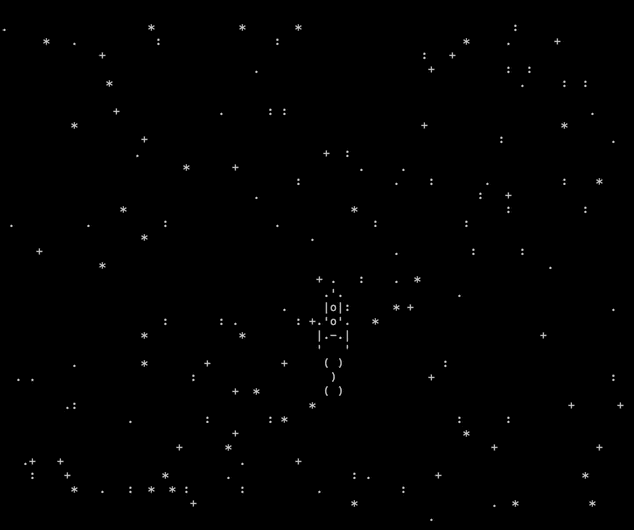

# Игра про космос

На экране проекция космоса с 1957 года. Вы двигаетесь на космическом корабле. Со временем появляется все больше космического мусора. Вы должны избежать столкновения с ним, а с 2020 года на корабле появится пушка, с помощью сможете его уничтожать.

## Цели проекта

Код написан в учебных целях — для курса по Python и веб-разработке на сайте [Devman](https://dvmn.org).
